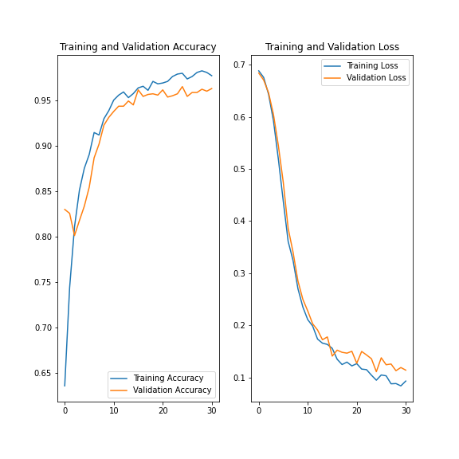

# SMS Classifier:
Using the sms spam [dataset](http://www.dt.fee.unicamp.br/~tiago/smsspamcollection/) to train a network to classifiy sms messages.
The notebook file can be viewed [here](https://nbviewer.jupyter.org/github/HatemSelim94/sms_classifier/blob/main/fcc_sms_text_classification%20.ipynb).
### **Dataset**:
the data set contains labled messages.

example:
| label | message                                                                                                                                                    |
|-------|------------------------------------------------------------------------------------------------------------------------------------------------------------|
| ham   | What you doing?how are you?                                                                                                                                |
| spam  | URGENT! Your Mobile No 07808726822 was awarded a L2,000 Bonus Caller Prize on 02/09/03! This is our 2nd attempt to contact YOU! Call 0871-872-9758 BOX95QU |
### **Preprocessing**:
To train the network, the data set is preprocessed first:
1. the train dataset is first resampled to contain well-balanced ratio between spam and ham messages.
2. represent the labels with numbers: 0 for ham and 1 for spame messages.
3. tokenize the words by creating a dictionary that maps each word to a certain number.
4. create a sequence for each messages in the dataset.

### **Network**:

| - | layer                          | I/O     |
|---|--------------------------------|---------|
| 1 | embedding                      | 50 / 16 |
| 2 | global average pooling 1d      | 16 / 16 |
| 3 | dense                          | 16 / 16 |
| 4 | dropout                        | 16 / 16 |
| 5 | dense                          | 16 / 1  |
| 6 | activation function (sigmoid)  | 1 / 1   |

### **Result**:

